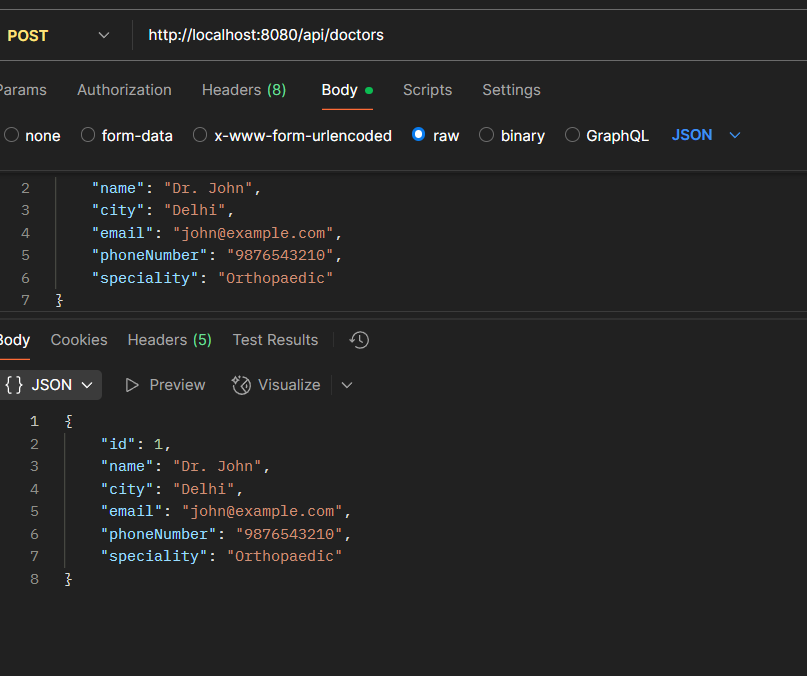
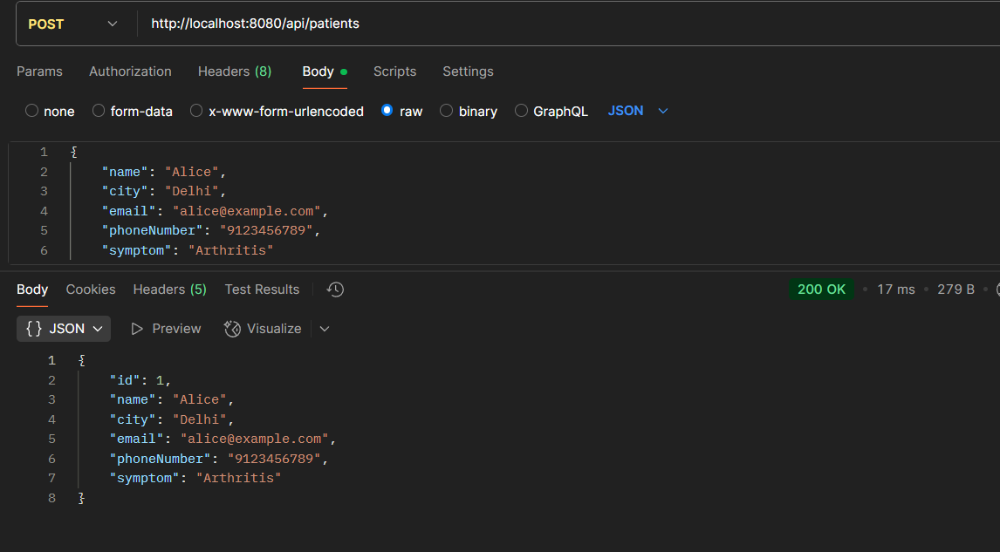
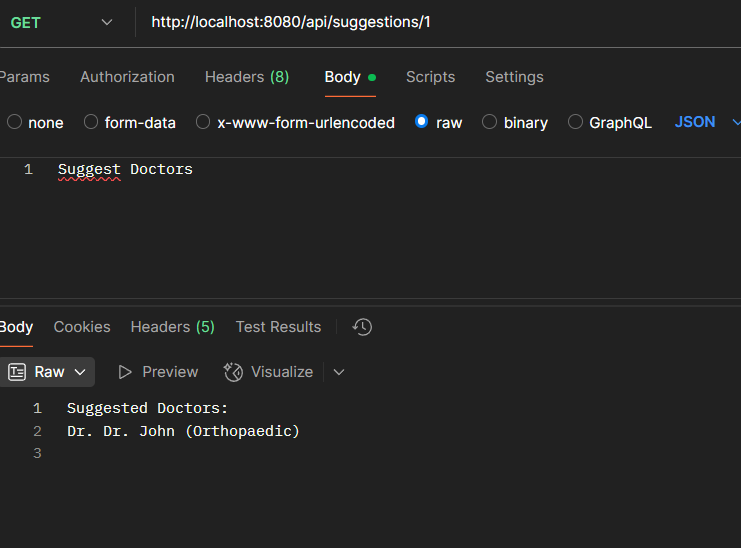
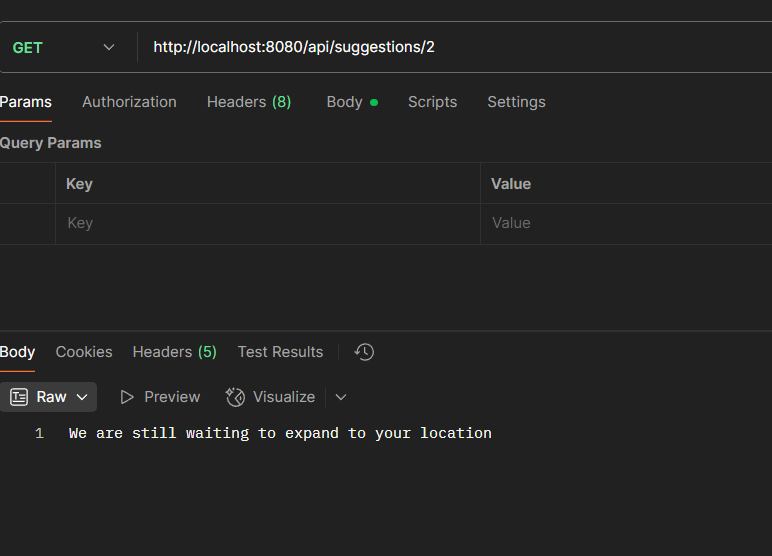
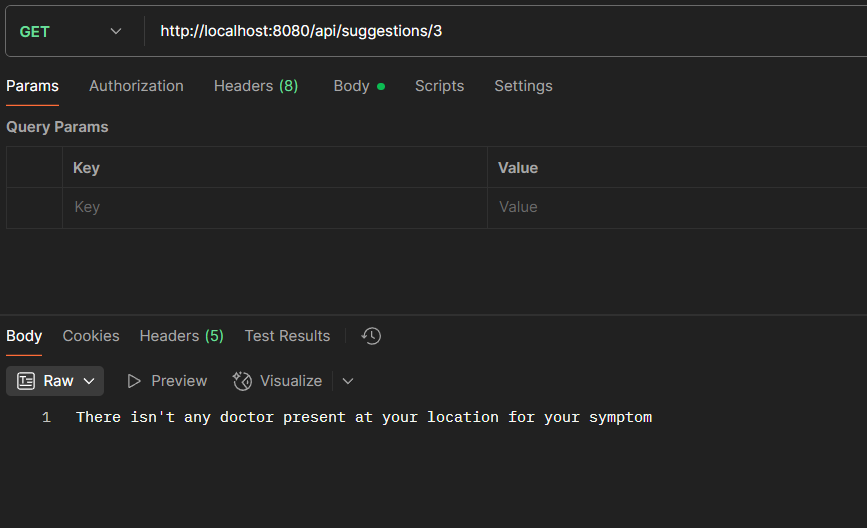
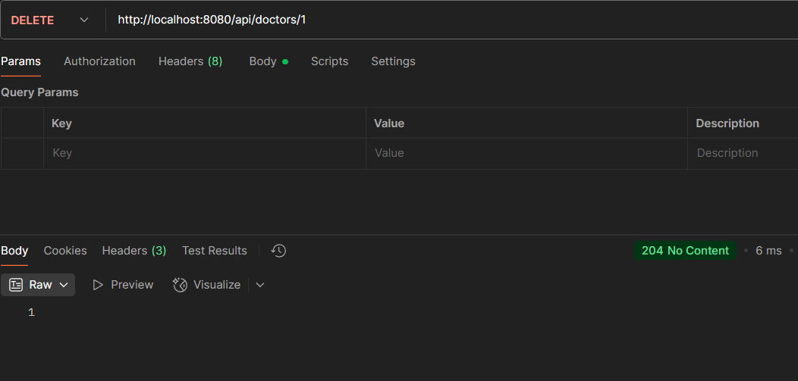
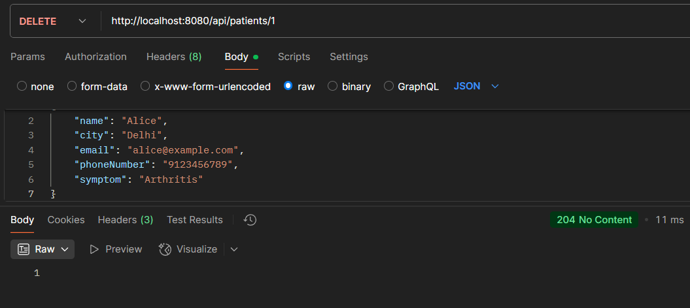

# Xcelore Java Technical Assignment

A Spring Boot (3.3.11) application with Springdoc OpenAPI (2.6.0) and Java 17 to manage doctors and patients, and suggest doctors based on symptoms and location.

## Setup
1. Clone: `git clone https://github.com/<your-username>/xcelore-assignment`
2. Install Java 17 and Maven.
3. Run: `mvn spring-boot:run`
4. Access APIs: `http://localhost:8080`
5. Swagger UI: `http://localhost:8080/swagger-ui.html`
6. Import `postman/Xcelore_Assignment.postman_collection.json` into Postman.

## APIs
- POST /api/doctors
- DELETE /api/doctors/{id}
- POST /api/patients
- DELETE /api/patients/{id}
- GET /api/suggestions/{patientId}

## Screenshots
- Add Doctor: 
- Add Patient: 
- Suggest Doctors: 
- Edge Case 1: 
- Edge Case 2: 
- Delete Doctor: 
- Delete Patient: 